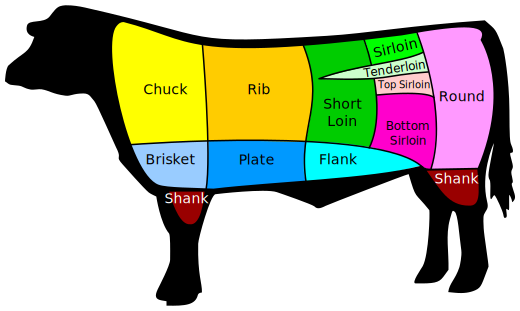

## Ingredients
- 金钱展 or 牛腱子 (Beef Shank) 
- 三酱：甜面酱，豆腐乳，生抽酱油
- 糖，盐，料酒，五香粉
- 肉蔻，良姜，香叶
- 葱白，姜

## Steps
- 牛肉清水泡3-4小时去腥（最好可以流水）
- 生腌
	- 甜面酱，豆腐乳，生抽，糖，盐，料酒，五香粉
	保鲜膜盖住隔夜
- 拿出来倒高压锅加佐料：
	- 肉蔻，良姜，香叶
	- 酱油，糖，盐
	- 葱白，姜
	加水到盖过肉
- 高压锅 Meat 45mins
- 好了以后赶快放气，牛肉拿出来晾凉，然后放冰箱隔夜方便切片

## Misc
- 生腌多放点甜面酱和料酒。咸甜口，糖盐比2:1
- 高压锅前多放点酱油。还要再加糖盐（2:1）。
- 一次多做一点，切好放冰箱冷冻可以吃一个月。炒饭，下面，当零食直接吃。